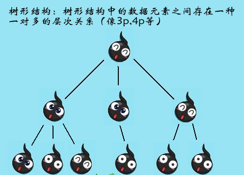

### 数据结构（程序=数据结构 +  算法）
数据结构就是关系， 就是数据元素相互直接存在的一种或多种特定关系的集合。
传统上，我们把数据结构分为逻辑结构和物理结构。
逻辑结构：是指数据对象中数据元素之间的相互关系，也是我们今后最需要关注和讨论的问题。
物理结构：是指数据的逻辑结构在计算机中的存储形式。
常用的数据结构有：

数组（array）,队列（queue），堆（heap），栈（stack），链表（linked list），树（tree），图（graph）和散列表（hash）。

栈（stack）：运算只在表的一端进行；
队列（queue）：运算只在两端进行，只允许在一端进行插入操作，而在另一端进行删除操作的线性表。
与栈相反，队列是一种先进先出（Frist in Frist out 　ＦＩＦＯ）的线性表。
与栈相同的是，队列是一种重要的线性结构，实现一个队列同样需要顺序表或链表作为基础。
四大结构
### 集合结构

###  线性结构

### 树形结构 

### 图形结构

顺序存储和链式存储
数据元素的存储结构形式有两种：顺序存储和链式存储。
例如 我们编程语言的数组结构就是这样的

 链式存储结构：是把数据元素存放在任意的存储单元里。这组存储单元可以是连续的，也可以是不连续的。
链式存储结构

 
线性表
线性表：就好像是排队一样，具有线一样的性质的结构，它是由零个或多个数据元素组成的有限序列。
若元素存在多个，则第一个元素无前驱，而最后一个元素无后继，其他的元素都有且只有一个前驱和后继。
若将线性表记为（a1......ai-1,ai,ai+1,....an）,则表中ai-1领先于ai，ai领先于ai+1，称ai-1是ai的直接前驱元素，ai+1是ai的直接后继元素。

数据类型
数据类型：是指一组性质相同的值的集合及定义在此集合上的一些操作的总称。

例如很多编程语言的整型，浮点型，字符型。。。这些指的就是数据类型。

在计算机中，内存不是无限大的，如果要计算或者处理一些比较大的数时，需要开辟比较大的内存空间，于是就要对计算机进行数据类型的分类，分出多种数据类型来适合各种不同的计算条件差异。

在c语言中 数据类型可以分为两类：
原子类型：不可以再分解的基本类型，例如整型，浮点型，字符型等
结构类型：由若干个类型的组合而成，是可以再分解的，例如整型数组是由若干整型数据组成的。

算法
 
算法是解决特定问题的求解步骤的描述，在计算机中表现为指令的有限序列，并且每条指令表示一个或者多个操作。
算法是具有五个基本特征：输入、输出、有穷性、确定性、和可行性。
输出：算法至少有一个或者多给输出。
有穷性：指算法在执行有限的步骤之后，自动结束而不会出现无限循环，并且每一个步骤在可接受的时间内完成。
确定性：算法的每一个步骤都具有确定的含义，不会出现二义性。
可行性：算法的每一步都必须是可行的，也就是说，每一步都能够通过执行有限次数完成。
正确性：算法的正确性是指算法至少应该具有输入、输出和加工处理无歧义性、能正确反映问题的需求、能够得到问题的正确答案。
高级语言编写的程序在计算机运时所消耗的时间取决于下列因素：

1.算法采用的策略，方案。
2.编译产生的代码质量。
3.问题的输入模式。
4.机器执行指令的速度。

我们可以想象，线性表有两种物理存储结构：顺序存储结构和链式存储结构。

线性表的顺序存储结构，指的是用一段地址连续的存储单元依次存储线性表的数据元素。

顺序存储结构封装需要三个属性：

存储空间的起始位置：数组data，它的存储位置就是线性表存储空间的存储位置。
线性表的最大存储容量：数组的长度MaxSize。
线性表的当前长度：length。
