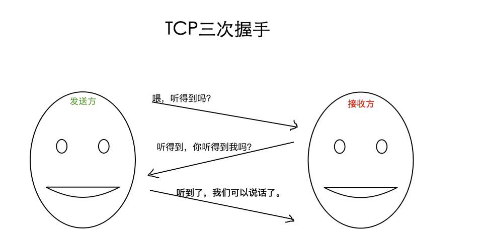

### TCP的三次握手

为了保证服务端能收接受到客户端的信息并能做出正确的应答而进行前两次(第一次和第二次)握手，为了保证客户端能够接收到服务端的信息并能做出正确的应答而进行后两次(第二次和第三次)握手

知乎上的一个回答，从另外一个角度阐释：
>在Google Groups的TopLanguage中看到一帖讨论TCP“三次握手”觉得很有意思。贴主提出“TCP建立连接为什么是三次握手？”的问题，在众多回复中，有一条回复写道：“这个问题的本质是, 信道不可靠, 但是通信双发需要就某个问题达成一致. 而要解决这个问题, 无论你在消息中包含什么信息, 三次通信是理论上的最小值. 所以三次握手不是TCP本身的要求, 而是为了满足"在不可靠信道上可靠地传输信息"这一需求所导致的. 请注意这里的本质需求,信道不可靠, 数据传输要可靠. 三次达到了, 那后面你想接着握手也好, 发数据也好, 跟进行可靠信息传输的需求就没关系了. 因此,如果信道是可靠的, 即无论什么时候发出消息, 对方一定能收到, 或者你不关心是否要保证对方收到你的消息, 那就能像UDP那样直接发送消息就可以了.”。这可视为对“三次握手”目的的另一种解答思路。

### TCP 是什么？
TCP（Transmission Control Protocol 传输控制协议）是一种面向连接的、可靠的、基于字节流的传输层通信协议。

#### 为什么要三次握手
>在谢希仁著《计算机网络》第四版中讲“三次握手”的目的是“为了防止已失效的连接请求报文段突然又传送到了服务端，因而产生错误”。在另一部经典的《计算机网络》一书中讲“三次握手”的目的是为了解决“网络中存在延迟的重复分组”的问题。

我们作为前端经常听说三次握手 殊不知还有四次挥手

TCP连接的拆除需要发送四个包，因此成为四次挥手（four-way handshake）客户端或服务器均可主动发起挥手动作，在socket编程中，任何一方执行close()操作即可产生挥手操作。

#### 为什么建立连接协议是三次握手，而关闭连接却是四次握手

这是因为服务端的LISTEN状态下的SOCKET当收到SYN报文的连接请求后，它可以把ACK和SYN(ACK起应答作用，而SYN起同步作用)放在一个报文里来发送。但关闭连接时，当收到对方的FIN报文通知时，它仅仅表示对方没有数据发送给你了；但未必你所有的数据都全部发送给对方了，所以你可能未必会马上会关闭SOCKET,也即你可能还需要发送一些数据给对方之后，再发送FIN报文给对方来表示你同意现在可以关闭连接了，所以它这里的ACK报文和FIN报文多数情况下都是分开发送的。